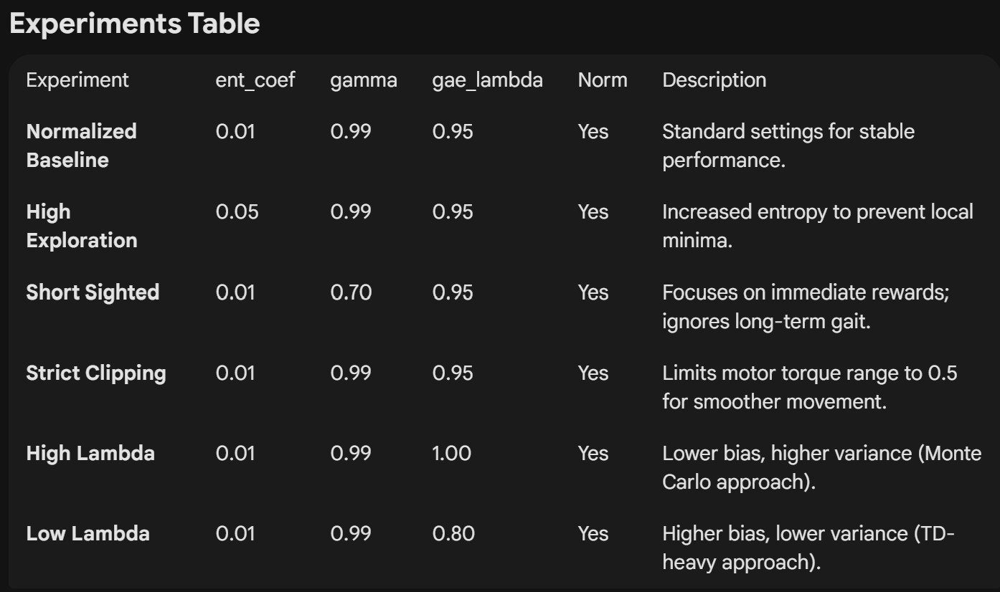

# BipedalWalker-v3: PPO Hyperparameter Ablation Study

This repository investigates the impact of various hyperparameters on the training stability and performance of a Proximal Policy Optimization (PPO) agent in the `BipedalWalker-v3` environment.

## Installation

```bash
pip install gymnasium[box2d] stable-baselines3[extra] shimmy
```



## Usage

- To execute all ablation tests sequentially run train.py

- To load a specific model and its normalization statistics to record a performance video run evaluate.py

- The remaining files starting with eval are all videos of the final performances of the experiments ran

# Here are the results of the greatest training run of 1M timesteps per experiment:


# Here are the results of a previous run of 500K timesteps per experiment


# Here is the video of the best model that developed a graceful frollick

https://github.com/user-attachments/assets/af6b87bb-0fb4-4c85-b8c2-974a6bdc25ab
